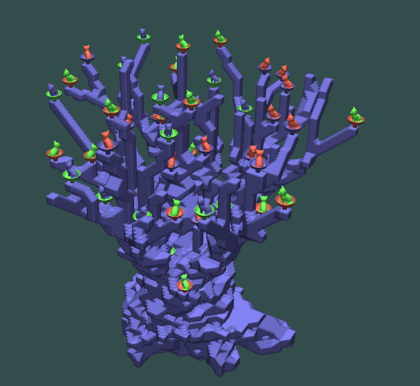
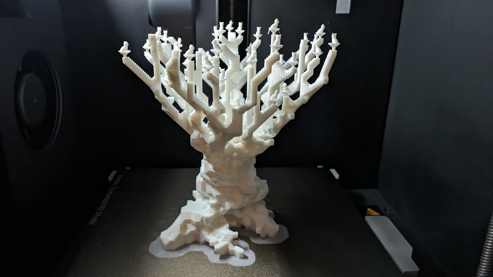

# What is this

It is a program that generates a 3d-printable tree populated by lots of small cats. 45 cats to be precise.

# What does the tree look like

# Can I print it

Maybe, it worked for me on a Bambu P1S. Model available from https://makerworld.com/en/models/480868#profileId-392522 .

# How does it work

The tree is grown procedurally in voxels using a space colonization algorithm, then rendered to a triangle mesh.

To make the tree look more realistic, a strengthening algorithm is used based on weight and wind resistance.

The cats are added on high-up flat areas with space above.

# License

This work is licensed under a Creative Commons (4.0 International License) Attribution-NonCommercial license - https://creativecommons.org/licenses/by-nc/4.0/ .

The cats are a "Cute Low Poly Cat (No Supports)" model from https://www.printables.com/model/594620-cute-low-poly-cat by Matthias L ( https://www.printables.com/@MatthiasL ).
The cat model is used under Creative Commons (4.0 International License) Attribution-NonCommercial terms.
The model was not changed other than scaling/translation to incorporate into the tree.
This project is not endorsed by the creator of the cat model and no warranties are provided.
Any sharing of this project must follow the license terms for the cat model.
